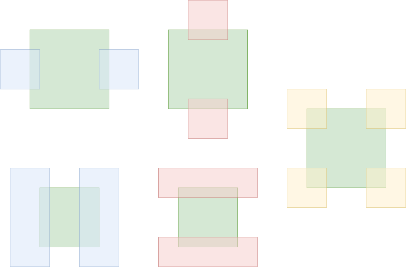

=  Bounceable Object

* 게임 상의 객체들중 일부는는 이동중 다른 객체에 부딪히면 튕겨 납니다.

== TODO

* Bounceable 객체는 이동 할 수 있으며, 다른 객체와 충돌하면 튕겨 납니다.
* 객체와의 충돌하는 경우는 다양하지만, 문제를 단순화 시키기 위해 아래와 같이 정의합니다.
+

+
** 초록색을 고정된 객체라고 할때,
*** 파란색은 X축 이동 방향이 변경되는 경우이고,
*** 붉은색은 Y축 이동 방향이 변경되는 경우이며,
*** 노란색은 X축과 Y축 이동 방향이 함께 변경되는 경우입니다.