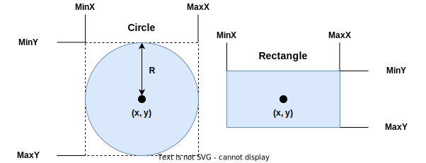
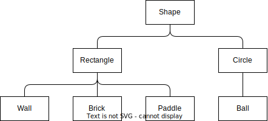

:stem: latexmath

= 도형 클래스 계층 만들기

* 동일한 형태의 도형이 다른 이름으로 존재합니다. 클래스 계층으로 해결 하세요.

== TODO

* Shape 클래스를 정의하세요.
** 도형이 차지하는 영역 가운데를 중심 좌표로 정의합니다.
** 영역은 사각형을 기준으로 하여, 폭과 너비를 갖습니다.
** 형태가 결정되지 않아 실체화 될 수는 없습니다.
+

+
** 반복된 연산의 혼란을 줄이기 위해 추상화 합니다.
*** 도형이 자치하는 좌표계의 최소값과 최대값을 반환하는 메서드를 추가해 활용합니다.
*** getX(): 도형의 중심 X 좌표를 반환합니다.
*** getY(): 도형의 중심 Y 좌표를 반환합니다.
*** getMinX(): 도형이 차지 하는 영역에서의 최소 X 좌표값을 반환합니다.
*** getMaxX(): 도형이 차지 하는 영역에서의 최대 X 좌표값을 반환합니다.
*** getMinY(): 도형이 차지 하는 영역에서의 최소 Y 좌표값을 반환합니다.
*** getMaxY(): 도형이 차지 하는 영역에서의 최대 Y 좌표값을 반환합니다.
* 형태가 결정되어 그릴 수 있는 도형 클래스를 정의합니다.
** 둥근 형태의 Circle 클래스가 있습니다.
*** Circle 클래스를 확장하여 Ball 클래스를 정의합니다.
** 사각 형태의 Rectangle 클래스가 있습니다.
*** Rectangle 클래스를 확장하여 Paddle 클래스, Brick 클래스, Wall 클래스를 정의합니다.
+
